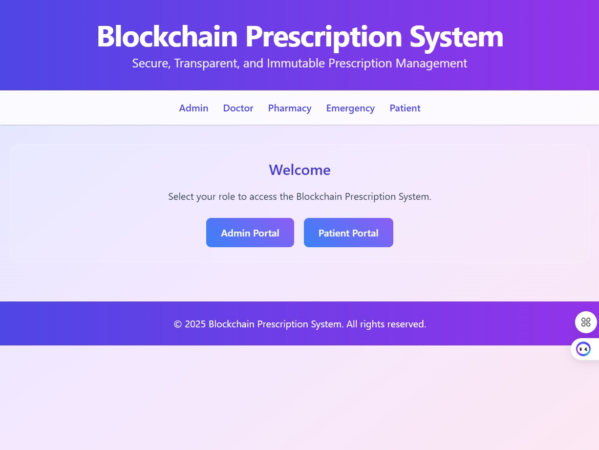
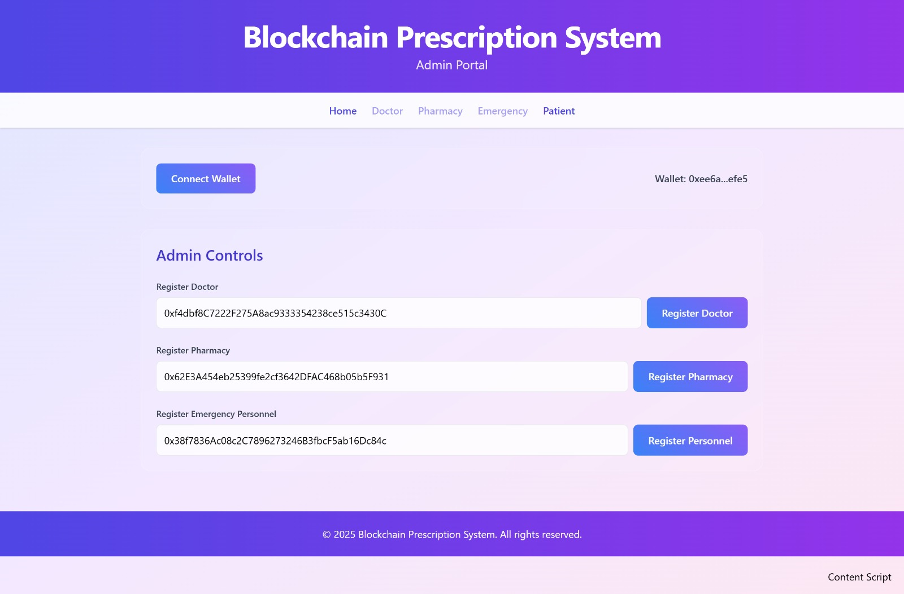
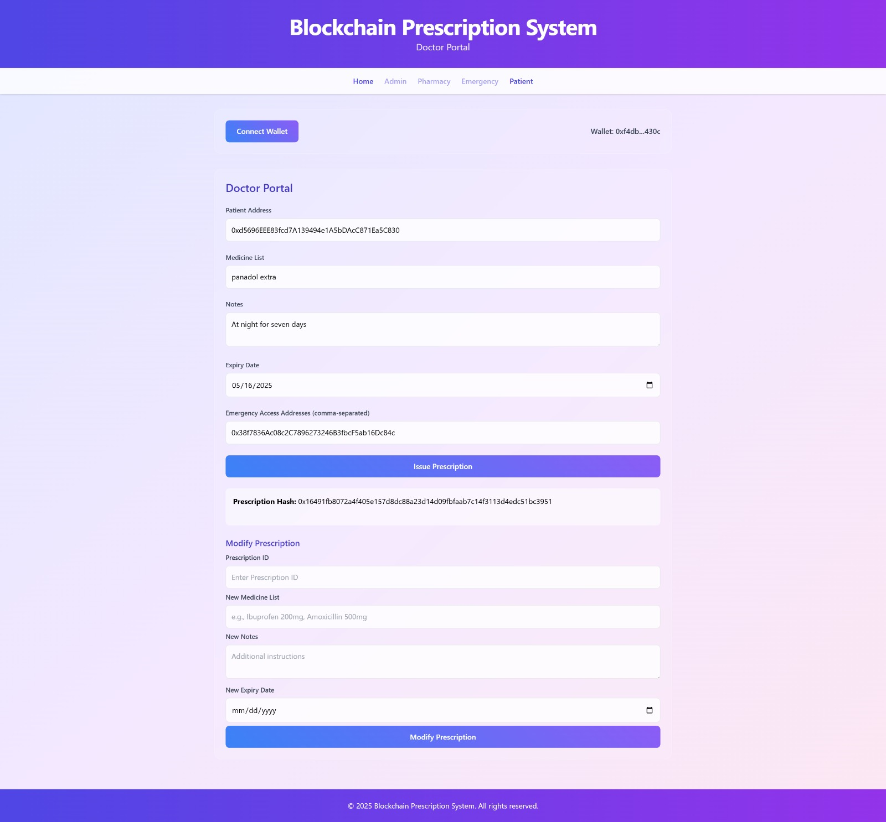
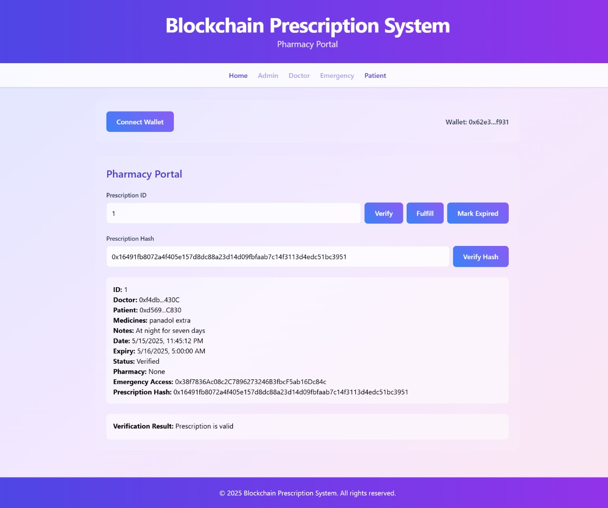
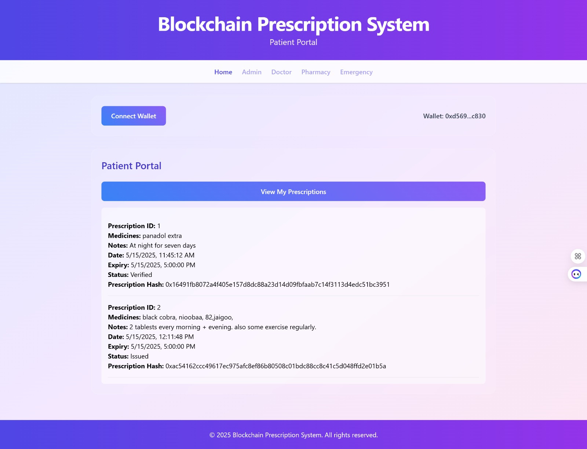
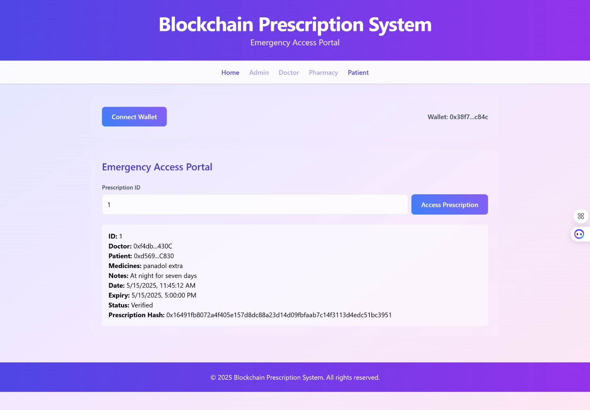
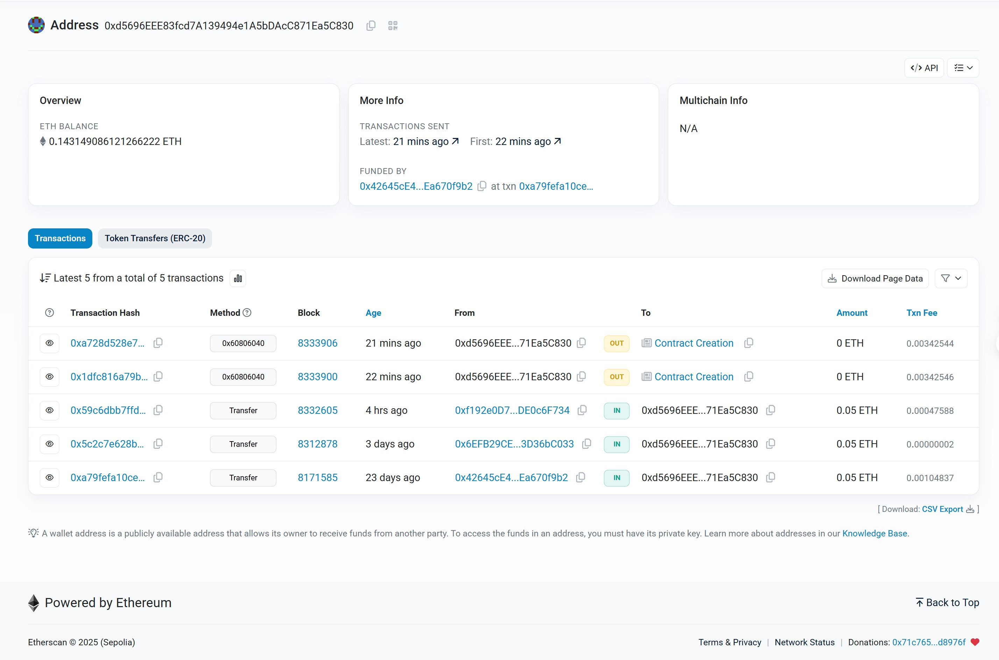

# ⛓️ Blockchain-Based Prescription Verification System

### Secure Healthcare Prescription Management using Ethereum Smart Contracts

<p align="center">


</p>

---

## Overview

Blockchain-Based Prescription Verification System is a decentralized healthcare application that securely manages medical prescriptions using Ethereum blockchain technology.

The platform ensures:

- Prescription authenticity
- Tamper-proof medical records
- Decentralized verification
- Patient privacy
- Secure emergency access
- Transparent healthcare transactions

All prescription-related operations are recorded on the blockchain, providing immutability, transparency, and fraud prevention.

The system eliminates counterfeit prescriptions and enables trusted collaboration between healthcare stakeholders.

---

## Key Features

### Blockchain-Powered Prescription Management

- Prescription issuance
- Prescription modification
- Prescription verification
- Prescription fulfillment
- Expiry tracking

### Security & Transparency

- Tamper-proof prescription records
- Blockchain transaction history
- Immutable audit trail
- Smart contract enforcement

### Role-Based Access Control

- Admin
- Doctor
- Pharmacy
- Patient
- Emergency Personnel

### Emergency Healthcare Access

Authorized emergency personnel can access patient prescriptions during critical situations when permission is granted by the doctor.

---

## Problem Statement

Traditional prescription systems suffer from:

- Prescription forgery
- Lack of transparency
- Data manipulation
- Poor auditability
- Limited emergency accessibility

This project addresses these issues using blockchain technology and smart contracts.

---

## System Roles

### Admin

Responsible for:

- Registering doctors
- Registering pharmacies
- Registering emergency personnel

Only authorized users can access system functionality.

### Doctor

Can:

- Issue prescriptions
- Modify prescriptions
- Assign emergency access
- Define expiry dates

Each prescription generates a unique blockchain hash.

### Pharmacy

Can:

- Verify prescriptions
- Verify prescription hashes
- Fulfill prescriptions
- Mark prescriptions as expired

Ensures that prescriptions are authentic and have not been tampered with.

### Patient

Can:

- View personal prescriptions
- Track prescription history

### Emergency Personnel

Can:

- Access prescriptions during emergencies
- View prescription details after authorization

---

## Technology Stack

### Blockchain

- Ethereum

### Smart Contracts

- Solidity

### Frontend

- HTML
- CSS
- JavaScript

### Wallet Integration

- MetaMask

### Network

- Ethereum Sepolia Testnet

### Transaction Monitoring

- Etherscan

---

## Architecture

```text
Doctor
   │
   ▼
Issue Prescription
   │
   ▼
Smart Contract
   │
   ▼
Ethereum Blockchain
   │
   ├────────► Patient
   │
   ├────────► Pharmacy
   │
   └────────► Emergency Personnel
```

---

## Application Workflow

### Step 1

Admin registers:

- Doctors
- Pharmacies
- Emergency Personnel

### Step 2

Doctor creates a prescription.

### Step 3

Prescription is stored on Ethereum blockchain.

### Step 4

A unique prescription hash is generated.

### Step 5

Pharmacy verifies:

- Prescription ID
- Blockchain hash
- Expiry status

### Step 6

Prescription is fulfilled.

### Step 7

Transaction becomes permanently recorded on-chain.

---

## Smart Contract Features

### Register Users

```solidity
registerDoctor()
registerPharmacy()
registerEmergencyPersonnel()
```

### Prescription Management

```solidity
issuePrescription()
modifyPrescription()
verifyPrescription()
fulfillPrescription()
markExpired()
```

### Emergency Access

```solidity
grantEmergencyAccess()
viewPrescription()
```

---

## Screenshots

### Home


### Admin Portal



### Doctor Portal



### Pharmacy Portal



### Patient Portal



### Emergency Portal



### Blockchain Transaction History



---

## Project Structure

```text
Blockchain_Based_Prescription_Verification_System
│
├── Prescription.sol
├── app.js
├── index.html
├── admin.html
├── doctor.html
├── pharmacy.html
├── patient.html
├── emergency.html
├── style.css
├── README.md
└── LICENSE
```

---

## Installation

### Clone Repository

```bash
git clone https://github.com/ahadbuilds/Blockchain_Based_Prescription_Verification_System.git
```

### Open Project

```bash
cd Blockchain_Based_Prescription_Verification_System
```

### Install MetaMask

Install MetaMask browser extension.

### Connect to Sepolia Testnet

Configure MetaMask to use Ethereum Sepolia Test Network.

### Deploy Smart Contract

Deploy:

```text
Prescription.sol
```

using Remix IDE.

### Run Application

Open:

```text
index.html
```

in browser.

---

## Security Benefits

- Decentralized storage
- Tamper-proof records
- Fraud prevention
- Immutable transaction history
- Transparent verification
- Secure healthcare data management

---

## Future Enhancements

- IPFS integration
- Multi-hospital support
- Mobile application
- QR-code prescription verification
- Role-based dashboards
- Multi-chain deployment
- AI-powered prescription analysis

---

## Team Members

- Abdul Ahad
- Muhammad Wafa Abbas
- Abdul Rehman
- Muhammad Zaman

BS Computer Science

University of Engineering & Technology (UET), Lahore

---

## Disclaimer

This project was developed for educational, research, and portfolio purposes.

---

## License

Released for educational and academic use.
